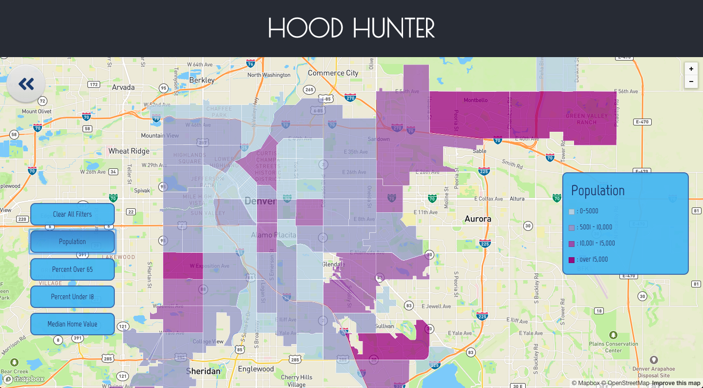
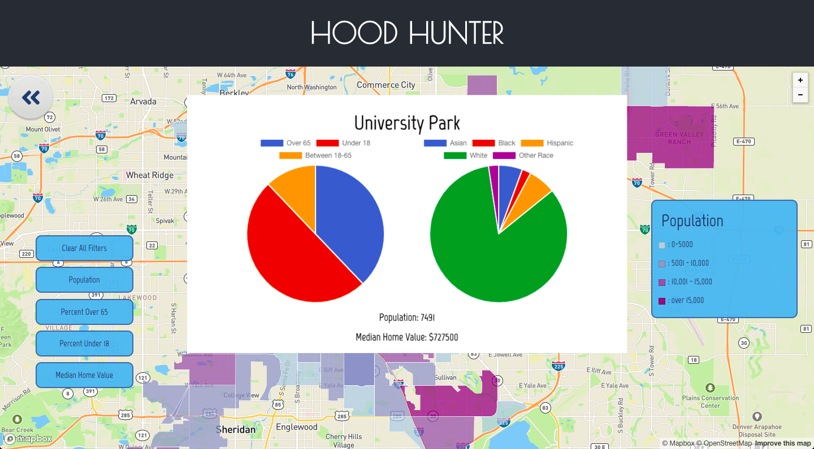
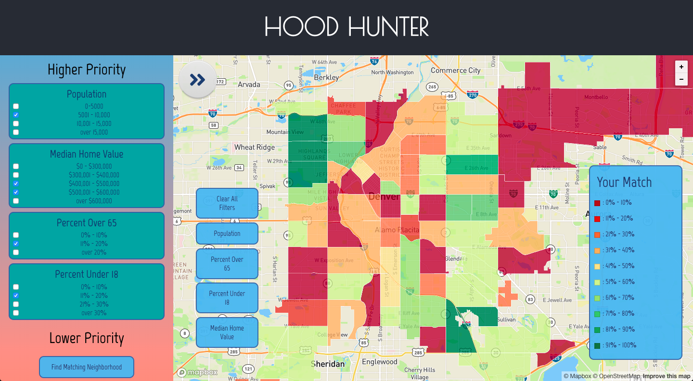

# Hood Hunter (Denver Edition)

Hood Hunter is an interactive neighborhood finder with map and data visualizations for your everyday real-estate investor or anyone looking to purchase a new home.

## Getting Started

## Built With

* [React](http://www.reactjs.org/) - The web framework used
* [Mapbox GL](http://www.mapbox.com/) - Mapping Library

## Author

**Kari Rosenberg** - *Initial work* - [karibeari](https://github.com/karibeari)

## Acknowledgments

* Hat tip to my husband, Elvis, for providing inspiration and encouragement for this project, the instructors at Flatiron School (Kyle, Damon, and Kevin) for helping me troubleshoot and debug, and my friend, Tom, for introducing me to Mapbox!
